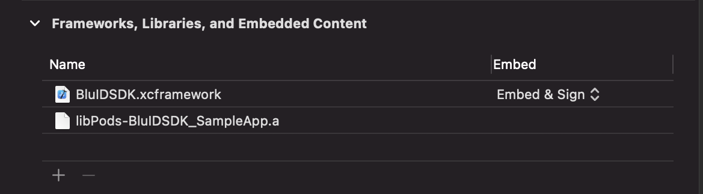
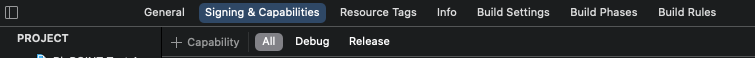
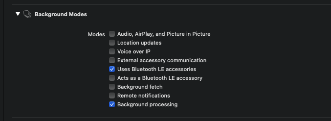
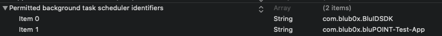

# BluID SDK-iOS-Sample
A sample iOS application for using BluID SDK 

## Get Started
1. Download the latest [release](https://github.com/blub0x/BluIDSDK-iOS-Sample/releases) 
2. Clone this repository
3. Create a BluB0X Occupancy account

   • Please contact BluB0X support for getting an BluB0X Occupance Manager account.

4. Create a General User Account

   • Login into https://blusky.blub0x.com with BluB0X Occupancy Manager account credentials


   • Click on Add User and enter user information and once added, the user will automatically get an 
     email with login credentials.


   • Further if needed BluB0X Occupancy Manager can assign credential(s) to the user(s)

5. Minimum Requirements
   
   • Xcode 12.5.1 or above


   • Xcode Deployment Target iOS 13 or above


   • Swift 5.4.2 or above
   
   • CocoaPods 

## Setup Instructions

1. Install pods in the project directory.

```
 cd [Project Directory]
 pod install
```

2. Open project (BluIDSDK.xcworkspace) in XCode and import BluIDSDK.xcframework in the project.

   • Extract BluIDSDK.xcframework file from [here](https://github.com/blub0x/BluIDSDK-iOS-Sample/releases/tag/v1.42) and copy the same. 


   • Import BluIDSDK.xcframework file into your project.

   


3. Configure iOS privacy permissions

   BluID SDK uses the phone's bluetooth adapter to discover nearby BluPOINT devices and interacts with them to perform operations.BluID SDK needs user consent      for Bluetooth permissions. Following are the keys needs to be added in project’s Info.plist

   • NSBluetoothAlwaysUsageDescription


   • NSBluetoothPeripheralUsageDescription


4. Enable Background Modes

   BluID SDK needs permission to run in the background, which allows your application to seamlessly authenticate BluPOINT devices without opening the                application.         

   • Open Project Settings


   • Navigate to Signing & Capabilities tab


   • Choose “+ Capabilities” option and select Background Modes

   

   • In Background Modes section, make sure to select option “Uses Bluetooth LE accessories” & “Background Processing”

   

   • In project info.plist, add the following key with bundle identifiers of BluID SDK & application.

     
    ◦    BGTaskSchedulerPermittedIdentifiers

    
      ▪ com.blub0x.BluIDSDK

    
      ▪ <application_bundle_identifier>

   

## BluID SDK Initialization

BluID SDK exposes all the API’s using the BluIDSDK instance. It is recommended to use a single instance of BluIDSDK throughout the application lifecycle.

1. First step is to import BluIDSDK in the application source file,

```swift
 import BluIDSDK
```

2. Then initialize SDK using the following code block,

```swift 
 val m_bluIDSDKClient = BluIDSDK()
```

3. By default, BluID SDK is set to production environment. You can also choose a different environment by using the following code block,

```swift
 val m_bluIDSDKClient = BluIDSDK(env:BluIDSDK_Environment)
```
  env: Environment parameter, is to choose from multiple BluSKY environments.

Please refer [Sample App's HomePage](https://github.com/blub0x/BluIDSDK-iOS-Sample/blob/main/BluIDSDK_SampleApp/MainScreenViewController.swift) file for BluID SDK Usage.

Follow this [documentation](https://blub0x.github.io/BluIDSDK-iOS/index.html) for BluID SDK API reference.
